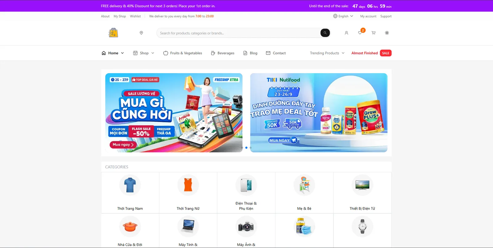
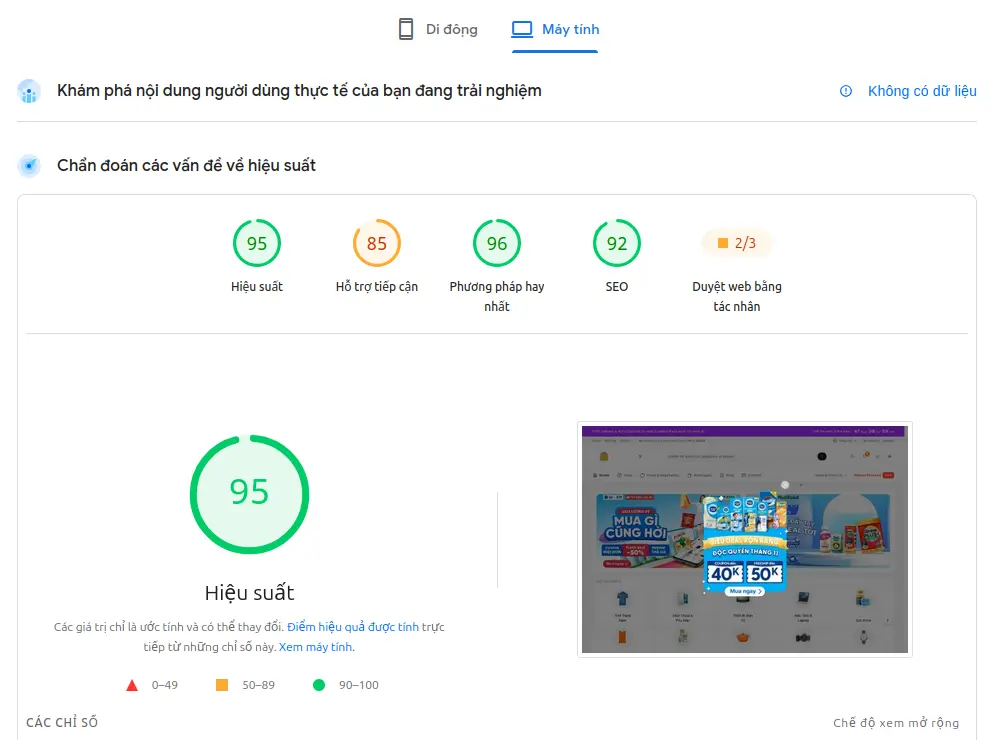

# <div align="center">


# 🚀 FastE — Next Generation E-Commerce Platform

### High-Performance • SEO First • Multi-language • Modern UI • Marketplace

[](https://nextjs.org/)
[](https://react.dev/)
[]
[]
[]

**FastE** is a modern marketplace platform built with **Next.js 15 App Router**, designed for exceptional performance, SEO, and user experience. It delivers a fast, scalable shopping experience with internationalization, Seller Center, Admin Dashboard, and enterprise-grade frontend architecture.

</div>

---

## 📸 Preview

| Home                        | Lighthouse                             |
| --------------------------- | -------------------------------------- |
|  |  |

---

# ✨ Features

## 🛍 Marketplace

* ⚡ Ultra-fast page rendering with App Router & Turbopack
* 🔍 Intelligent product search
* ❤️ Wishlist
* 🛒 Shopping cart
* 💳 Optimized checkout flow
* 📦 Product detail pages
* ⭐ Ratings & Reviews
* 🎯 Product recommendations
* 📱 Fully responsive design
* 🌙 Dark / Light mode
* 🔥 Skeleton loading & optimistic UI

---

## 🌍 Internationalization

Supports multiple languages:

* 🇺🇸 English
* 🇻🇳 Vietnamese
* 🇨🇳 Chinese
* 🇰🇷 Korean

Built using:

* i18next
* next-i18n-router
* Locale-aware routing
* hreflang
* Canonical URLs

---

## 🏪 Seller Center

Complete seller management dashboard.

### Products

* Product Management
* Categories
* Inventory
* Media Upload
* Variants

### Orders

* Order Management
* Shipping Status
* Returns
* Customer Messages

### Analytics

* Revenue
* Orders
* Products
* Visitors
* Charts & Reports

---

## 🛡 Admin Dashboard

Platform management system.

Features include:

* User Management
* Product Moderation
* Category Management
* Store Management
* Banner Management
* Reports
* Permission & Roles
* Platform Analytics

---

# 🚀 Performance

FastE is designed with performance as a first-class citizen.

### Optimizations

* Next.js App Router
* Turbopack
* Server Components
* Route-level Code Splitting
* Dynamic Imports
* Image Optimization
* WebP Images
* Lazy Loading
* Prefetching
* Suspense Streaming
* React Cache
* TanStack Query Caching
* Skeleton UI
* Bundle Optimization
* Font Optimization
* Edge-ready Deployment

---

# 🔍 SEO / GEO / AEO

FastE is optimized for both traditional search engines and AI-powered search.

### SEO

* Metadata API
* Dynamic Metadata
* Open Graph
* Twitter Cards
* robots.txt
* sitemap.xml
* Canonical URLs
* Structured Data (JSON-LD)
* Product Schema
* Organization Schema
* Breadcrumb Schema
* FAQ Schema

### GEO

Generative Engine Optimization for AI search engines.

Optimized for:

* ChatGPT
* Google AI Overview
* Perplexity
* Claude
* Gemini

### AEO

Answer Engine Optimization

* Semantic HTML
* Rich structured content
* FAQ
* Knowledge Graph ready
* AI-friendly metadata

---

# 🎨 UI / UX

Modern interface built with:

* Tailwind CSS v4
* Radix UI
* Lucide Icons
* GSAP
* Framer Motion
* Swiper
* Sonner
* Vaul
* Responsive Design

---

# 🛠 Tech Stack

## Frontend

* Next.js 15
* React 19
* TypeScript
* Tailwind CSS v4

## State Management

* Zustand
* TanStack Query v5

## Forms

* React Hook Form
* Zod
* Yup

## Charts

* Recharts

## Rich Text

* React Quill

## Media

* Cloudinary

## Authentication

* JWT
* Refresh Token
* Role-based Access Control

---

# 🧪 Developer Experience

* ESLint
* Prettier
* Husky
* lint-staged
* Commitlint
* Storybook 9
* Vitest
* Playwright

---

# 📂 Project Structure

```text
src
├── app
├── assets
├── components
├── configs
├── constants
├── hooks
├── i18n
├── layouts
├── lib
├── providers
├── services
├── stores
├── types
├── utils
├── views
└── middleware.ts
```

---

# 🚀 Getting Started

## Requirements

* Node.js >= 20
* npm / pnpm / yarn

## Installation

```bash
git clone https://github.com/ahkiet22/faste-client.git

cd faste-client

npm install
```

Create your environment file:

```bash
cp .env.example .env
```

Run development server:

```bash
npm run dev
```

Production build:

```bash
npm run build
```

Start production:

```bash
npm run start
```

Storybook:

```bash
npm run storybook
```

---

# 📈 Lighthouse

FastE is continuously optimized to achieve:

* 🚀 Performance: 95+
* ♿ Accessibility: 85+
* ✅ Best Practices: 96
* 🔍 SEO: 92

---

# 🤝 Contributing

Contributions are welcome!

1. Fork the repository
2. Create a feature branch
3. Commit your changes
4. Push your branch
5. Open a Pull Request

---

# 📄 License

Licensed under the **MIT License**.

---

<div align="center">

Made with ❤️ by **Lê Anh Kiệt**

⭐ If you like this project, don't forget to give it a star.

</div>
